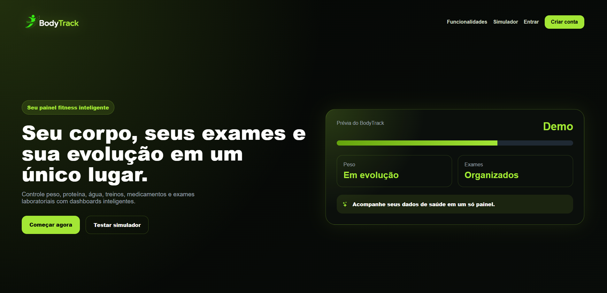
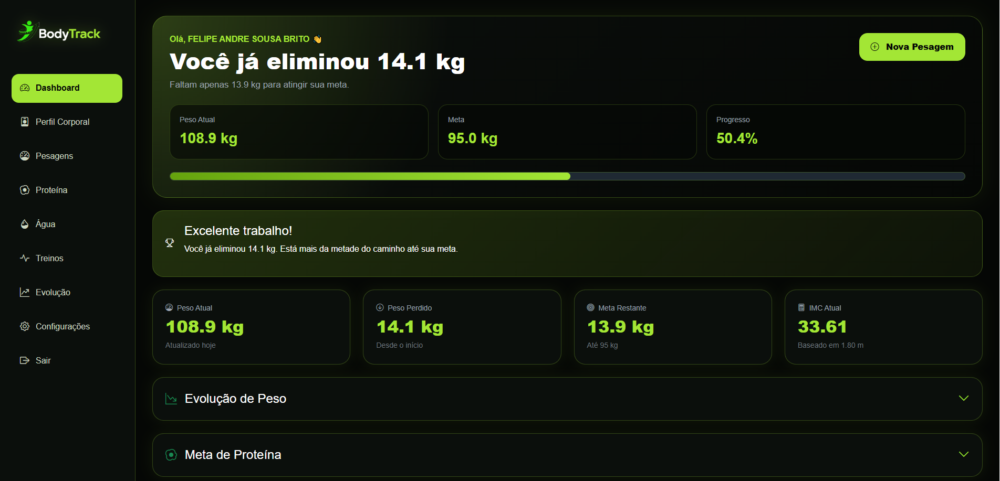
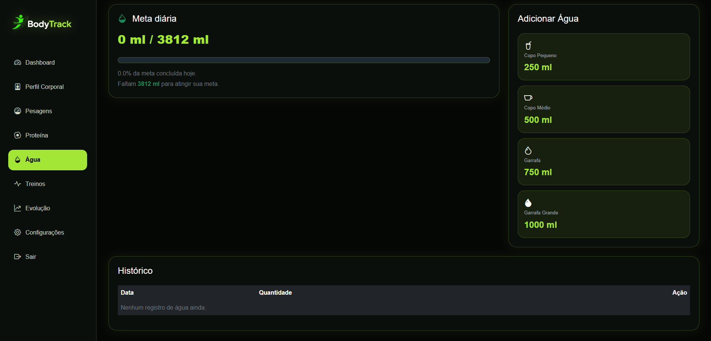
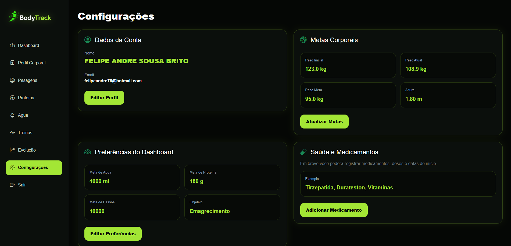

# 🟢 BodyTrack


---

# 📌 Sobre o Projeto

O **BodyTrack** é uma aplicação web desenvolvida para acompanhamento de evolução corporal, saúde e desempenho físico.

O objetivo do sistema é centralizar informações importantes da jornada do usuário em um único dashboard inteligente.

O projeto está sendo desenvolvido com foco em:

* Aprendizado avançado de Laravel
* Desenvolvimento Full Stack
* Arquitetura de aplicações web
* Criação de um produto real para portfólio

---

# 📸 Screenshots

## Landing Page



## Dashboard



## Controle de Água



## Configurações



---

# 🚀 Funcionalidades Implementadas (v0.1.0)

## 🔐 Autenticação

* Cadastro de usuários
* Login personalizado
* Logout
* Controle de sessão
* Proteção de rotas

---

## 📊 Dashboard Inteligente

Recursos atuais:

* Peso atual
* Peso perdido
* Meta restante
* IMC atual
* Barra de progresso corporal
* Card motivacional
* Gráficos interativos

---

## ⚖️ Controle Corporal

Cadastro de:

* Altura
* Peso inicial
* Peso atual
* Peso objetivo
* Objetivo corporal

Objetivos:

* Emagrecimento
* Ganho de massa muscular
* Recomposição corporal

---

## 💧 Controle de Água

Funcionalidades:

* Registro rápido
* Meta automática baseada no peso corporal
* Histórico de consumo
* Barra de progresso dinâmica
* Exclusão sem recarregar a página
* Atualização em tempo real
* SweetAlert2 para confirmações

---

## ⚙️ Configurações

Área do usuário contendo:

* Dados da conta
* Metas corporais
* Preferências
* Estrutura para futuras integrações

---

# 🎨 Interface

Identidade visual própria:

* Tema Dark
* Verde Lime
* Dashboard Premium
* Sidebar personalizada
* Cards modernos
* Layout responsivo

---

# 🛠 Tecnologias Utilizadas

## Backend

* PHP 8.5
* Laravel 13
* Laravel Breeze
* Eloquent ORM
* SQLite

## Frontend

* Blade
* Bootstrap 5
* Bootstrap Icons
* JavaScript
* Fetch API
* ApexCharts
* SweetAlert2

---

# ⚙️ Instalação

```bash
git clone https://github.com/FelipeAndre76/BodyTrack.git

cd BodyTrack

composer install

cp .env.example .env

php artisan key:generate

php artisan migrate

php artisan serve
```

---

# 📂 Estrutura Principal

```text
BodyTrack

├── Dashboard
├── Perfil Corporal
├── Pesagens
├── Água
├── Configurações

├── Login
├── Registro
└── Logout
```

---

# 🎯 Objetivo

O BodyTrack foi criado para centralizar informações de saúde, evolução corporal e hábitos diários em uma única plataforma.

Além do uso pessoal, o projeto funciona como laboratório de estudos para aprofundamento em Laravel, arquitetura web, UX/UI e desenvolvimento Full Stack.

---

# 🧠 Funcionalidades Futuras

## 🥩 Nutrição

* Controle de proteína diária
* Controle alimentar
* Macronutrientes

## 🏋️ Treinos

* Cadastro de exercícios
* Divisão de treino
* Histórico de evolução

## 🩺 Saúde

* Upload de exames laboratoriais
* Histórico médico
* Controle de medicamentos
* Análise de exames

## 🤖 BodyTrack AI

* Interpretação de dados corporais
* Recomendações personalizadas
* Insights de evolução

---

# 🗺 Roadmap

## v0.1.0

* [x] Autenticação
* [x] Dashboard
* [x] Perfil Corporal
* [x] Controle de Peso
* [x] Controle de Água
* [x] Configurações

## v0.2.0

* [ ] Proteína
* [ ] Nutrição
* [ ] Treinos

## v0.3.0

* [ ] Exames laboratoriais
* [ ] Medicamentos
* [ ] Evolução por fotos

## v1.0.0

* [ ] BodyTrack AI
* [ ] Aplicação Mobile
* [ ] Relatórios avançados

---

# 👨‍💻 Desenvolvedor

**Felipe André Sousa Brito**

Projeto desenvolvido para estudo, portfólio e evolução profissional utilizando Laravel e tecnologias modernas de desenvolvimento web.
